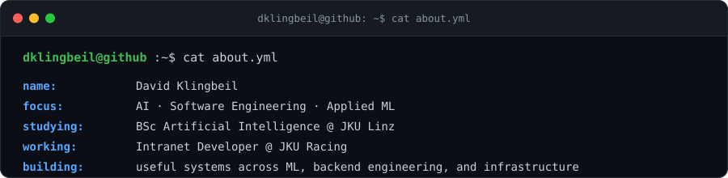
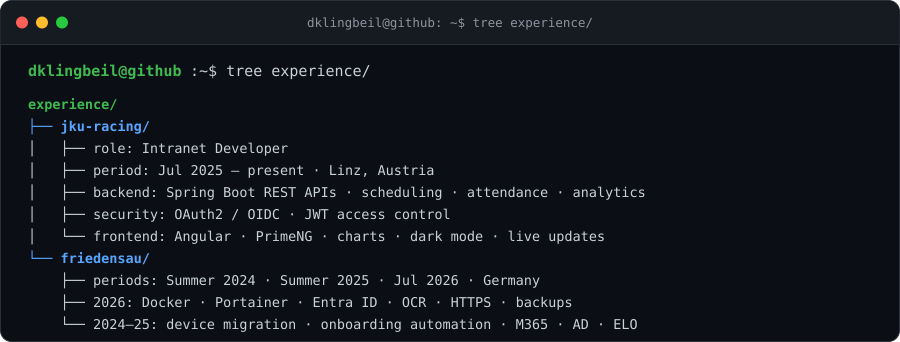
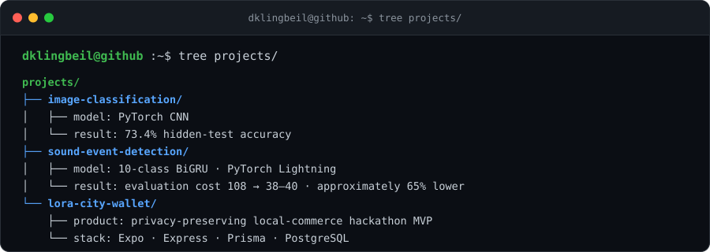
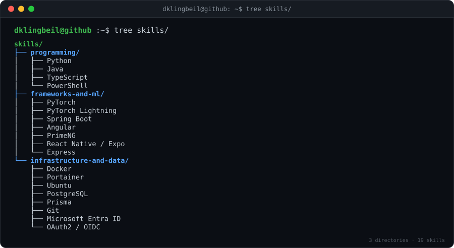
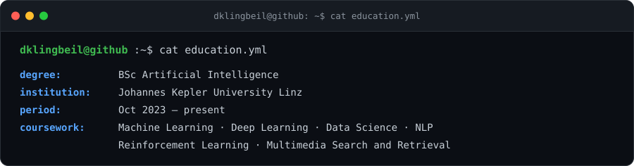
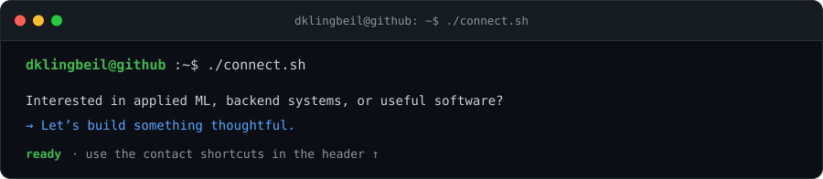

# David Klingbeil

### AI Student · Software Engineering · Applied ML

[Portfolio](https://davidklingbeil.org/) · [LinkedIn](https://linkedin.com/in/david-klingbeil) · [Email](mailto:dklingbeil777@gmail.com)

## About

## Experience

[JKU Racing ↗](https://jkuracing.at/)

## Selected Projects

[Image Classification ↗](https://github.com/dklingbeil/Image-Classification-Project) · [Sound Event Detection ↗](https://github.com/dklingbeil/MLCP-Project) · [Lora / City Wallet ↗](https://github.com/dklingbeil/City-Wallet)

## Technical Stack

## Contribution Activity

## Education

## Let’s Connect

